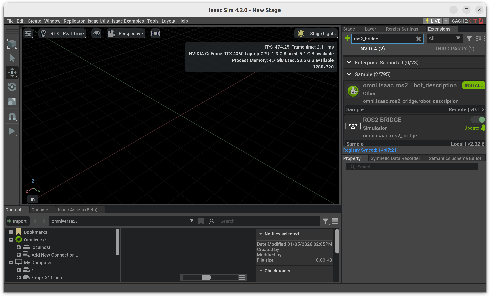
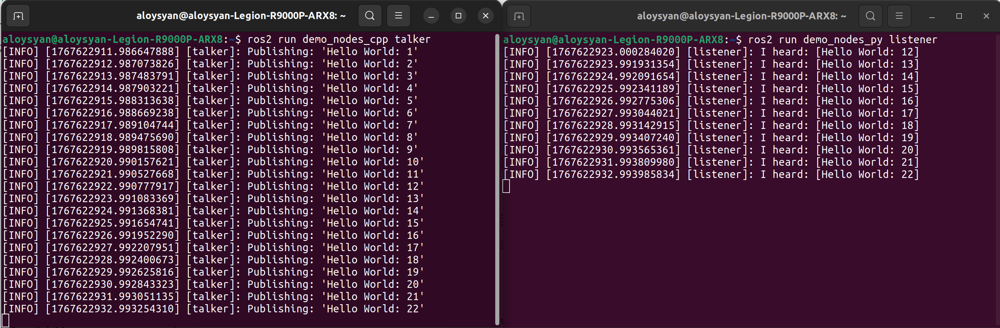

## 
视觉组 颜铭含 12月工作月报

### 一、工作流程

`OpenCV 学习` → `YOLO 目标检测` → `Ubuntu 环境配置` → `Gazebo/Isaac Sim 仿真` → `ROS2 学习`

---

### 二、工作内容

#### 0. 技术路线确定

* `Unitree L2 (原始点云)` → `FAST-LIO2 (实时里程计/建图)` → `Pointcloud_to_Laserscan (降维处理)` → `Nav2 (全局/局部路径规划)`

#### 1. OpenCV

* **学习重点：** 图像预处理（灰度化、高斯滤波）、色彩空间转换（HSV/RGB）、边缘检测等
* **具体应用：** 实现基于传统视觉的简单目标提取
* **产出：** 编写了使用OpenCV的识别模块

### 2. YOLO

* **任务内容：** 学习使用 YOLO v8，用于赛场复杂场景下的目标识别，此工作后移交黄益鹏负责
* **实施细节：**
  * **数据集准备：** 进行数据采集与标注（XAnyLabeling / Roboflow）
  * **模型训练：** 针对比赛目标进行迁移学习，优化训练参数，开始尝试TensorRT加速

### 3. 仿真

* **系统部署：** 配置 Ubuntu 开发环境，配置 NVIDIA 相关驱动与 CUDA 环境，加装CuDNN卷积神经加速模块
* **仿真搭建选型：**
  * **Gazebo：** Gazebo Harmonic
  * **NVIDIA Isaac Sim：** 4.2.0
* 现在 Gazebo 上部署，后视情况观察是否需要移植到 Issac Sim

### 4. ROS2

* **技术选型：**  ROS2 Humble
* **开发内容：**
  * 完成环境配置与安装，调试发布了 Talker 和 Listener 话题，待正式开展工作

---

### 三、1月计划

1. **算法优化：** 在 Nanodet 上进行 TensorRT 加速
2. **仿真：** 视觉仿真部署
3. **ROS2：** 与电控组配合，学习通信API接口编写